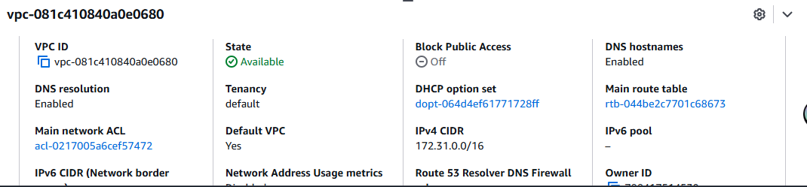
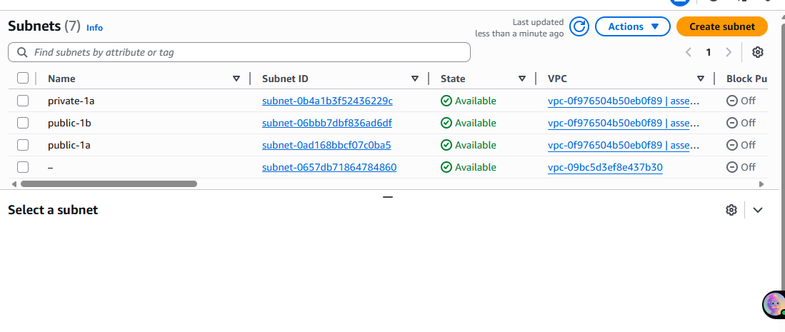

# Task 1 – Custom VPC with Public & Private Subnets

## Requirements achieved
- Custom VPC (10.0.0.0/16)  
- 2 Public subnets + 2 Private subnets across ap-south-1a & 1b  
- Internet Gateway attached  
- NAT Gateway + Elastic IP in public subnet  
- Separate public & private route tables with correct routes

## Screenshots

**VPC**  

**Subnets**  

**Internet Gateway**  

**NAT Gateway (active)**  

**Private Route Table → NAT**  

**All resources destroyed on 2025-12-04** – zero cost.
